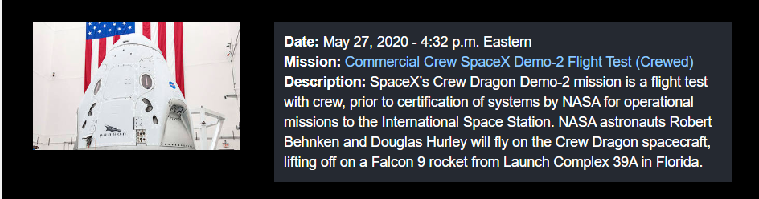

# 🚀 NASA Web Crawler 

Rastreador Web do cronograma de lançamento da NASA.

## Criando Um Novo Projeto

Antes de começarmos nossa coleta de dados, você precisa configurar um novo projeto Scrapy; caso contrário nada funcionará! 
Usando a ferramenta de *Terminal* do seu Sistema Operacional, entre na pasta que você vai guardar seu código e digite o comando abaixo:

```python
scrapy startproject nasa_web_crawler
```

Este comando vai criar uma nova pasta com o seguinte conteúdo:

```bash
nasa_web_crawler/
    
    scrapy.cfg            # Arquivo de configuração de implantação.

    nasa_web_crawler/     # Módulo Python do Projeto: você vai programar seu rastreador usando os arquivos aqui dentro
        
        __init__.py

        items.py          # Arquivo de Definição:

        middlewares.py    # Middlewares do Projeto:

        pipelines.py      # Pipelines do Projeto: 

        settings.py       # Arquivo de Configuração do Projeto:

        spiders/          # IMPORTANTE: diretório onde, daqui a pouco, você colocará seus coletores (Spiders)
            __init__.py
```

## Criando Um Novo Coletor (Spider)

**Spiders** são classes que você define para que o Scrapy as use para extrair informações de um site ou de um grupo de sites. Elas devem ser subclasses da classe `Spider` e definem as solicitações iniciais a serem feitas. Opcionalmente, os *Spiders* podem descrever como o coletor vai seguir os links nas páginas e como será feito o *parser* do conteúdo da página baixada para extração dados.

O código abaixo é nosso coletor (*Spider*) do [Cronograma de Lançamento da NASA](https://www.nasa.gov/launchschedule/), copie e cole o código em um novo arquivo chamado `cronograma_nasa.py` dentro da pasta `nasa_web_crawler/spiders`.

```python

```

### genspider

É possível criar um novo *Spider* usando a ferramenta de linha de comando do *Terminal*, para isso, usaremos a sintaxe abaixo:

```bash
scrapy genspider <nome> <domínio>
```

* `<nome>`: define o nome do seu coletor (Spider);
* `<domínio>`: define o endereço da web (URL) onde será feita a coleta de dados.

Este comando cria um novo coletor (*Spider*) dentro da pasta atual ou na pasta de `spiders` do projeto atual. 
Lembrando que os parâmetros `<nome>` e `<domínio>` **são obrigatórios** para que o comando funcione!

#### Exemplo

Entre no diretório `nasa_web_crawler/nasa_web_crawler` e digite o comando:

```bash
scrapy genspider cronograma_lancamento_nasa https://www.nasa.gov/launchschedule/
```

Essa instrução cria um novo coletor (*Spider*) chamando: `cronograma_lancamento_nasa.py`; dentro da pasta `nasa_web_crawler/spiders` contendo o seguinte código gerado automáticamente:

```python
# -*- coding: utf-8 -*-
import scrapy


class CronogramaLancamentoNasaSpider(scrapy.Spider):
    name = 'cronograma_lancamento_nasa'
    allowed_domains = ['https://www.nasa.gov/launchschedule/']
    start_urls = ['http://https://www.nasa.gov/launchschedule//']

    def parse(self, response):
        pass

```

Observe que o parâmetro `<nome>` configurou o nome do coletor na linha 6 `name = 'cronograma_lancamento_nasa'` e o parâmetro `<domínio>` definiu os atributos `allowed_domains` e `start_urls` que especificam respectivamente a lista de domínios permitidos que o coletor pode rastrear e lista de URLs de onde o coletor (*Spider*) começará a rastrear.

## Extraindo Dados

Após configurar seu Rastreador Web (Web Crawler), o primeiro passo que você precisa fazer para coletar dados em páginas da Web é estudar a estrutura do documento `HTML` e definir qual será a sua estratégia para obter os dados. No nosso caso queremos coletar as seguintes informações dos próximos lançamentos de foguetes da NASA: 

* **Imagem:** URL da imagem de divulgação do lançamento;
* **Date:** data do lançamento;
* **Mission:** nome da missão;
* **URL Mission:** URL da Página da Missão; 
* **Description:** descrição da missão;


Ao utilizar a ferramenta de inspeção de código fonte do navegador, descobrimos que os nossos dados estão estruturados da seguinte maneira:



```html
<div class="launch-event clearfix">

    <div class="launch-image">
        <a href="https://www.nasa.gov/specials/dm2/">
            
        </a>
    </div>

    <div class="launch-info">

        <div id="ember697" class="ember-view">
            <div class="date">
                <span class="launch-label">Date: </span>May 27, 2020 - 4:32 p.m. Eastern
            </div>
        </div>

        <div class="title">
            <span class="launch-label">Mission:</span>
            <a href="https://www.nasa.gov/specials/dm2/">Commercial Crew SpaceX Demo-2 Flight Test (Crewed)</a>
        </div>

        <div class="description">
            <span class="launch-label">Description:</span> SpaceX’s Crew Dragon Demo-2 mission is a flight test with crew, prior to certification of systems by NASA for operational missions to the International Space Station. NASA astronauts Robert Behnken and Douglas Hurley will fly on the Crew Dragon spacecraft, lifting off on a Falcon 9 rocket from Launch Complex 39A in Florida.
        </div>
        <!---->
    </div>
</div>
```


* **Imagem:** `div.launch-event/div.launch-image/a/img`;
* **Date:** `div.launch-event/div.launch-info/div.ember-view/div.date`;
* **Mission:** `div.launch-event/div.launch-info/div.title/a`;
* **URL Mission:** `div.launch-event/div.launch-info/div.title/a`; 
* **Description:** `div.launch-event/div.launch-info/div.description`.

Após fazer este estudo e mapeamento da estrutura do `HTML` da página Web que será feita a coleta, o próximo passo é programaramos nosso coletor (*Spider*) para visitar cada um destes elementos HTML que guardam nossos dados e fazermos a coleta de dados. Como você deve imaginar, iremos utilizar os Seletores CSS para acessar cada um dos elementos HTML na árvore DOM da página para pegar nossos dados.

